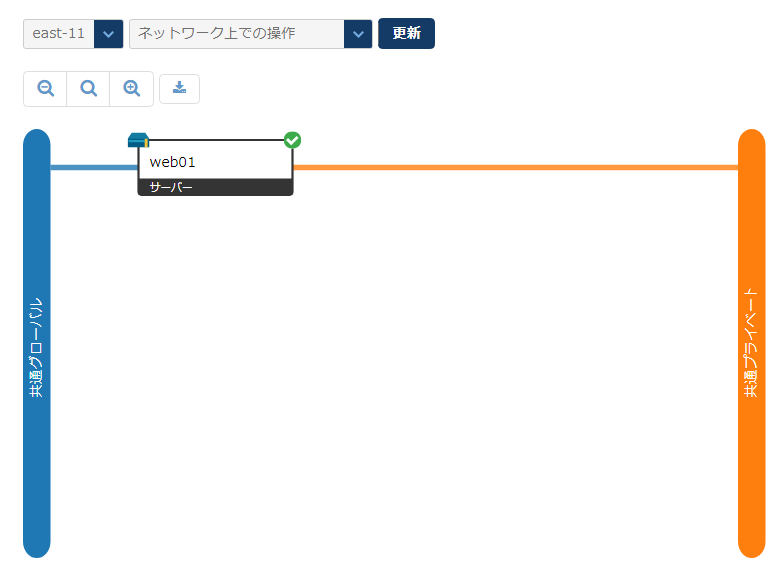
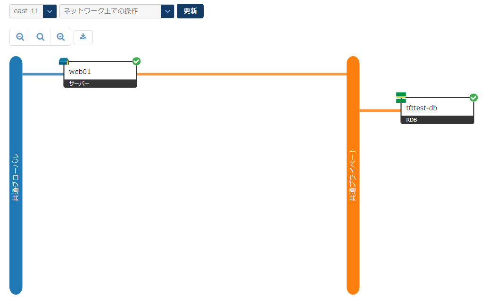
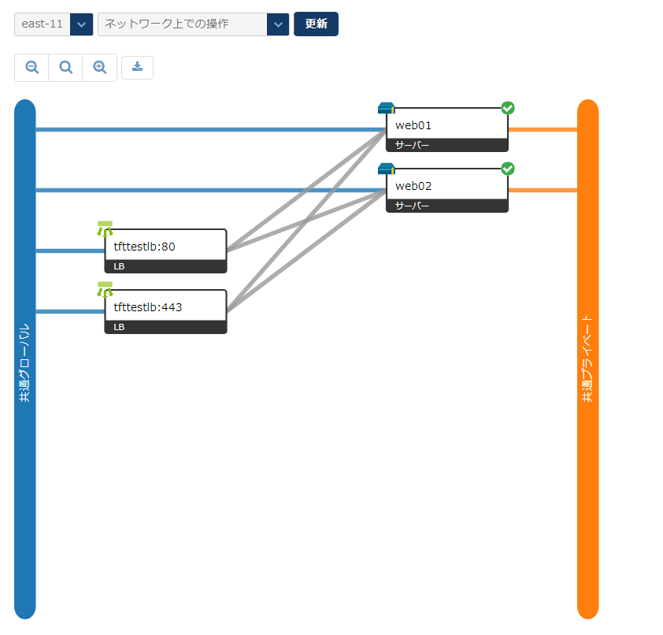
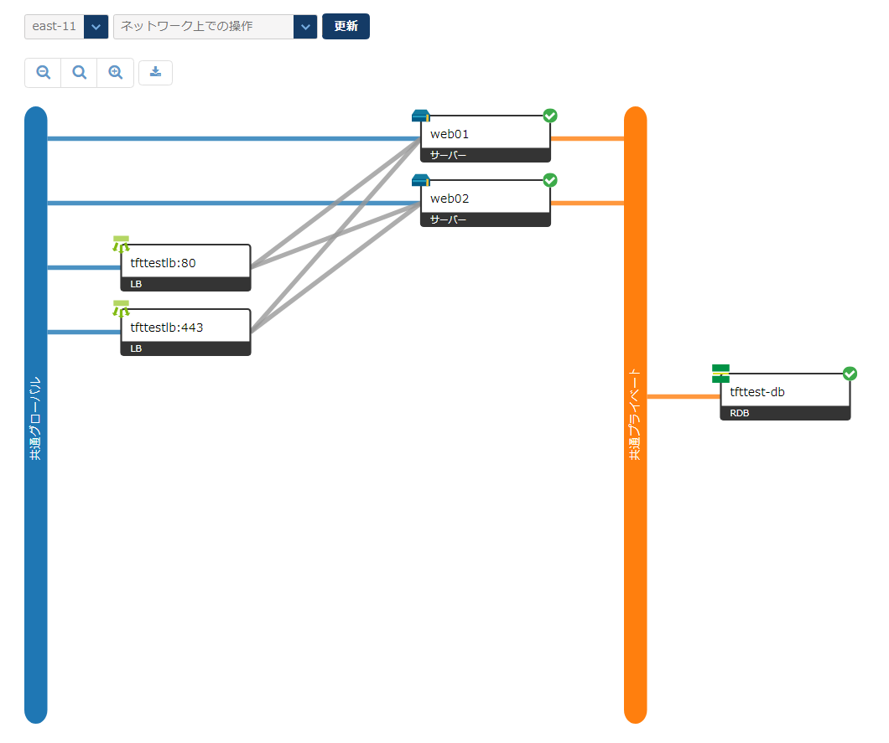
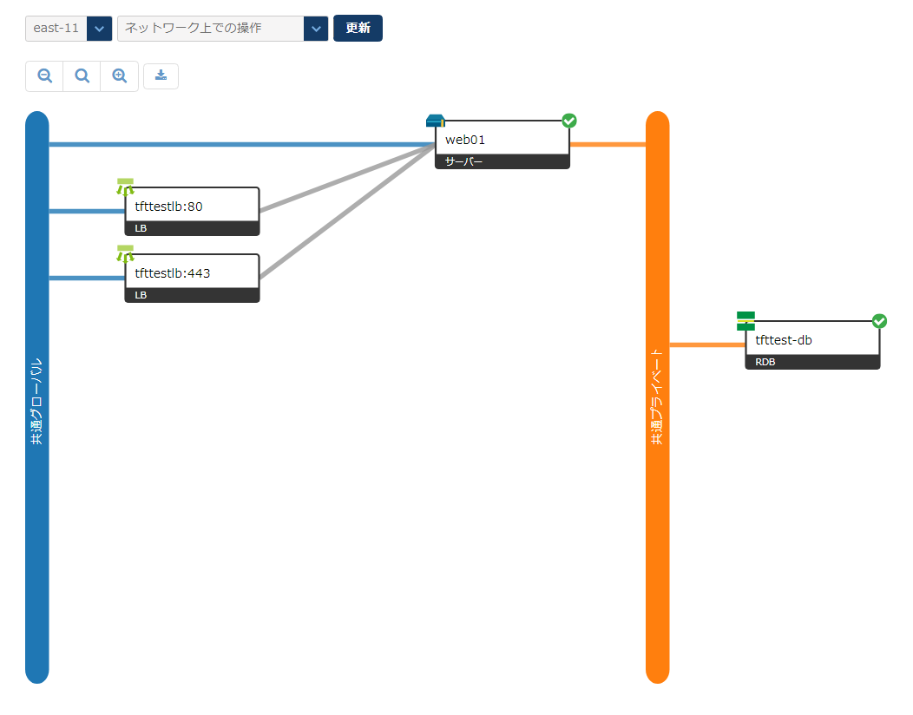
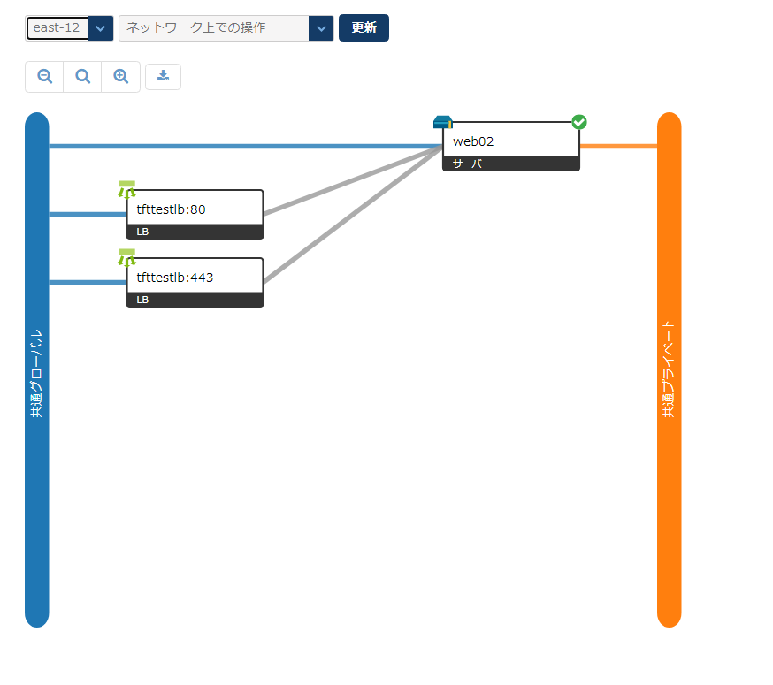
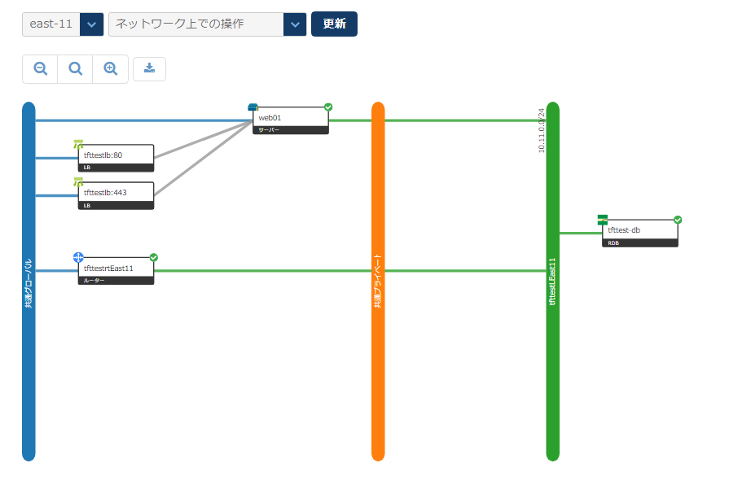
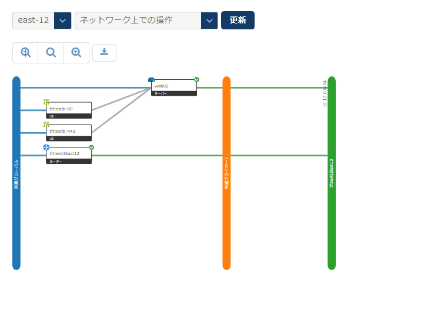
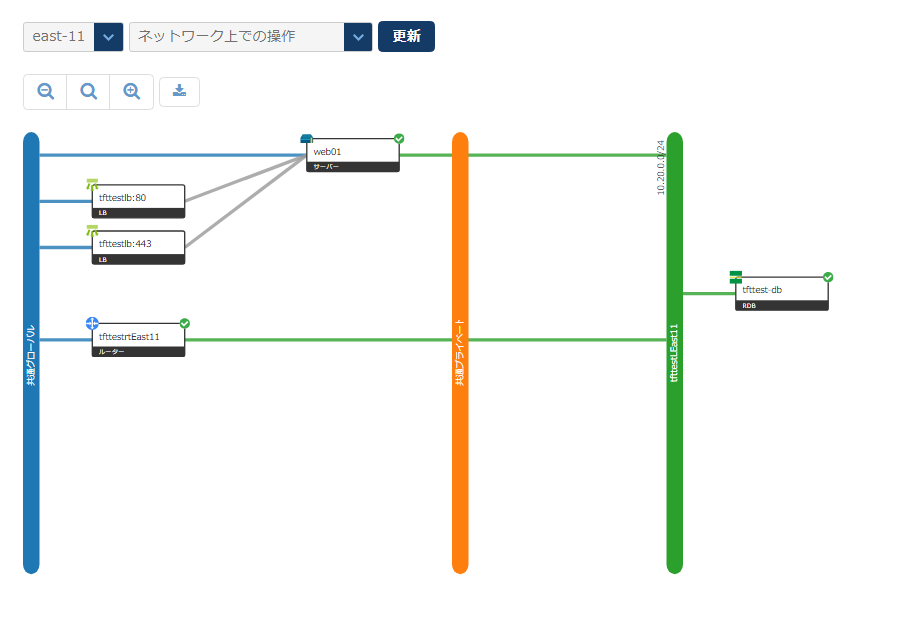
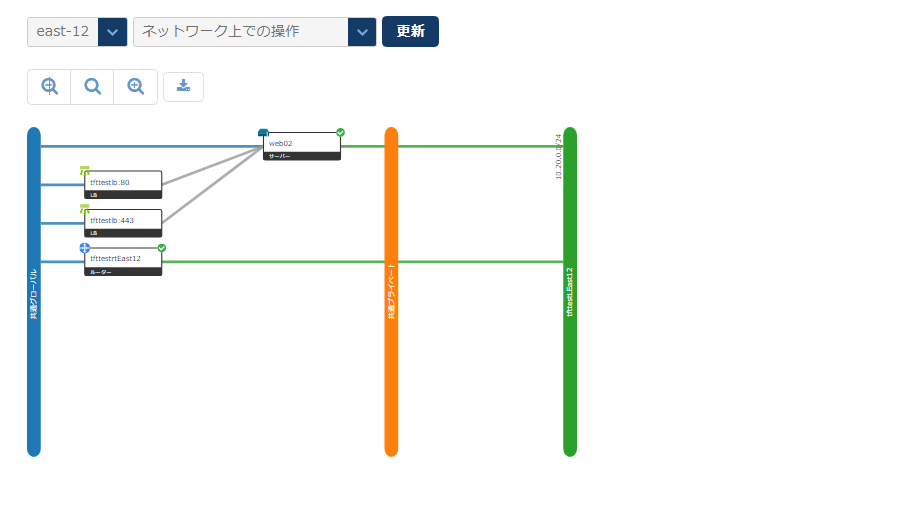

# 構成例

- [構成例](#構成例)
    - [Compute Instance 1台のみ](#compute-instance-1台のみ)
    - [Compute 1台, RDB, 共有Private LAN](#compute-1台-rdb-共有private-lan)
    - [Compute 2台, L4LB, 共有Private LAN](#compute-2台-l4lb-共有private-lan)
    - [Compute 2台(単一AZ), L4LB, RDB, 共有Private LAN](#compute-2台単一az-l4lb-rdb-共有private-lan)
    - [Compute 2台(Multi-AZ), L4LB, RDB, 共有Private LAN](#compute-2台multi-az-l4lb-rdb-共有private-lan)
    - [Compute 2台(Multi-AZ), L4LB, RDB, Private LAN](#compute-2台multi-az-l4lb-rdb-private-lan)
    - [Compute 2台(Multi-AZ), L4LB, RDB, Private LAN, Private Bridge](#compute-2台multi-az-l4lb-rdb-private-lan-private-bridge)


構成例と、varsファイルで設定するべき値について解説します。
(実用的ではない構成も含まれますが、あくまで設定の例として参照してください)

```
# (default)
```
と表記されているものはvariable.tfでデフォルトとなっている設定です。


### Compute Instance 1台のみ

Compute Instance 1台の最小構成です。


```
az = { "0" = "east-11" } # (default)
compute_instance_number = 1 # (default)
create_l4_loadbalancer = false # (default)
create_rdb = false # (default)
use_private_lan = false # (default)
use_private_bridge = false # (default)
```

### Compute 1台, RDB, 共有Private LAN

Compute Instance 1台、RDB 1台のシンプルな構成です。


```
az = { "0" = "east-11" } # (default)
compute_instance_number = 1 # (default)
create_l4_loadbalancer = false # (default)
create_rdb = true
use_private_lan = false
use_private_bridge = false
```

### Compute 2台, L4LB, 共有Private LAN

Compute Instanceを2台、L4LBでhttp,httpsを負荷分散アクセスさせます。


```
az = { "0" = "east-11" } # (default)
compute_instance_number = 2
create_l4_loadbalancer = true
create_rdb = false # (default)
use_private_lan = false # (default)
use_private_bridge = false # (default)
```

### Compute 2台(単一AZ), L4LB, RDB, 共有Private LAN

全てのリソースを単一AZに配置します。


```
az = { "0" = "east-11" } # (default)
compute_instance_number = 2
create_l4_loadbalancer = true
create_rdb = true
use_private_lan = false # (default)
use_private_bridge = false # (default)
```


### Compute 2台(Multi-AZ), L4LB, RDB, 共有Private LAN

共有Private LANを利用します。



```
az = {
  "0" = "east-11"
  "1" = "east-12"
}
compute_instance_number = 2
create_l4_loadbalancer = true
create_rdb = true
use_private_lan = false # (default)
use_private_bridge = false # (default)
```

### Compute 2台(Multi-AZ), L4LB, RDB, Private LAN

専用Private LANを利用します。



```
az = {
  "0" = "east-11"
  "1" = "east-12"
}
compute_instance_number = 2
create_l4_loadbalancer = true
create_rdb = true
use_private_lan = true
use_private_bridge = false
```


### Compute 2台(Multi-AZ), L4LB, RDB, Private LAN, Private Bridge

Private Bridgeを利用すると、AZをまたがってPrivate LANをL2接続ができるため、2つのAZのPrivate LANのSubnetが同じになるように、またComputeのIPアドレスが衝突しないように調整します。



```
az = {
  "0" = "east-11"
  "1" = "east-12"
}
compute_instance_number = 2
create_l4_loadbalancer = true
create_rdb = true
use_private_lan = true
use_private_bridge = true
```


